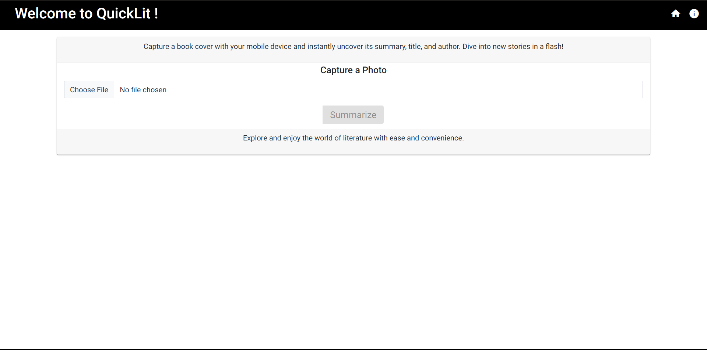
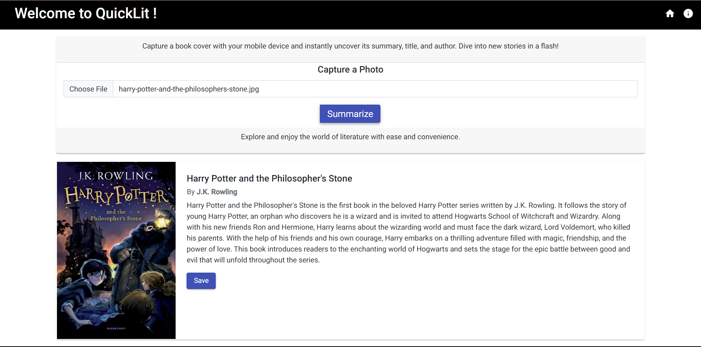
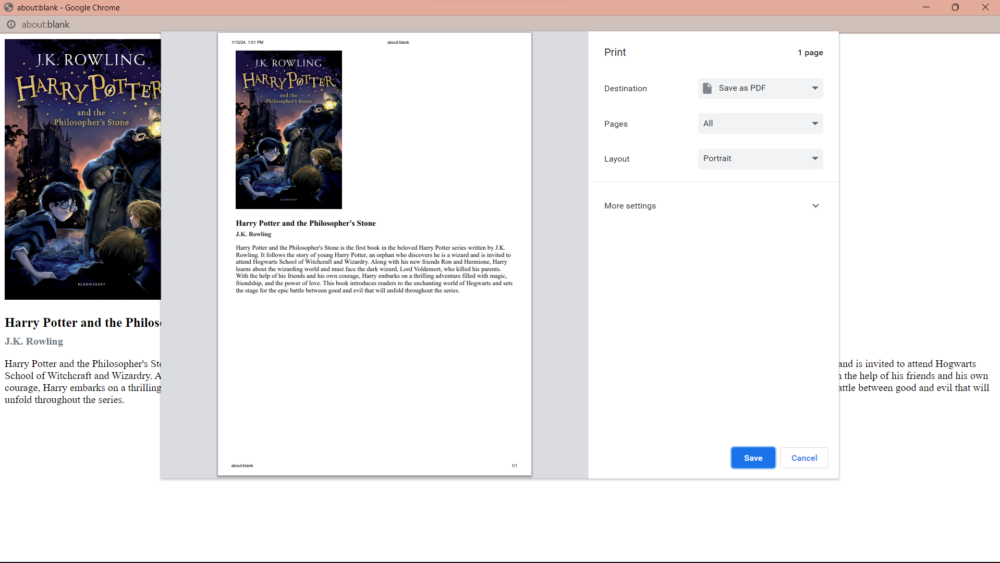

# QuickLit

## Overview

The QuickLit is a web application built with Angular for the frontend and Python for the backend. It allows users to upload a picture of a book cover, extracts the book title using Google Cloud Vision API, and then uses ChatGPT to generate a summary. Users can also save the summary as a PDF.

## Features

- **Image Upload:** Users can upload a picture of a book cover.
- **Google Cloud Vision API Integration:** Extracts the book title from the uploaded image.
- **ChatGPT Integration:** Generates book title, author, and summary in JSON format based on the extracted title.
- **PDF Export:** Users can save the generated summary as a PDF file.

## Prerequisites

- Node.js
- Angular CLI
- Python
- Google Cloud Vision API key
- OpenAI GPT-3 API key

## Getting Started

1. Clone the repository:

   ```bash
   git clone https://github.com/Loveena28/QuickLit-BookSummarizer
2. Install Angular dependencies:
    
    ```bash
    cd angular-frontend
    npm install
3. Configure backend:
    - Set up a virtual environment:
        ```bash
        cd python-backend
        python -m venv venv
        ```
    - Install Python dependencies:
        ```bash
        source venv/bin/activate  # On Windows: .\venv\Scripts\activate
        pip install -r requirements.txt
        ```
    - Set up configuration for Google Cloud Vision API and OpenAI GPT-3 API
4. Run the application:
    - Start the angular frontend
        ```bash
        cd angular-frontend
        ng serve
        ```
    - Start the python backend
        ```bash
        cd python-backend
        python main.py
        ```
    Access the application at http://localhost:4200 in your web browser.

## User Interface

The user interface of **QuickLit** is straightforward and consists of the following elements:

- A title at the top of the window, welcoming users to the application.

- An "Choose File" button for selecting an image.

- A "Summarize" button to initiate the summary generation.

- A loading indicator that appears during summary generation.

- A "Save" button to download summary and book cover's image as pdf.




